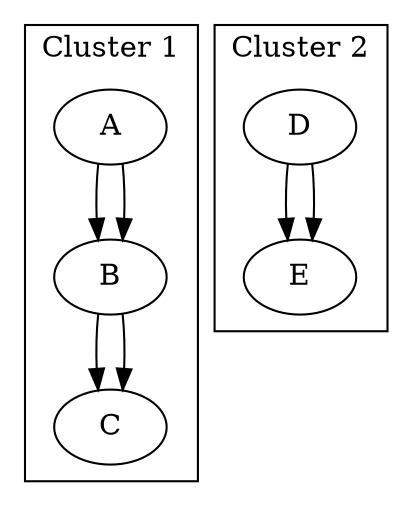

### 1. Cluster Subgraphs

Cluster subgraphs allow you to group nodes together visually, often with a bounding box and label. They are prefixed with `subgraph cluster`.

Here's a simple example:

Copy this DOT code into a file and run `dot -Tpng <filename.dot> -o output.png` to visualize the graph.

Would you like to proceed to the next feature?

---

(main branch ⎇)
###### aaa2a038-fe85-4b61-ac93-315b624f7960
[parent ⬆️](#2dfbde17-251d-4960-802d-72d431931ba2)
